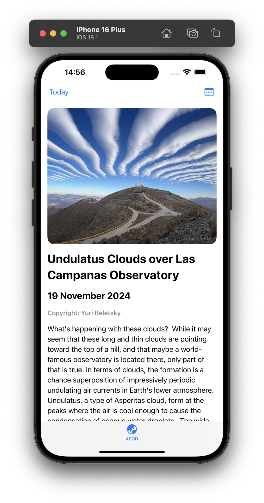
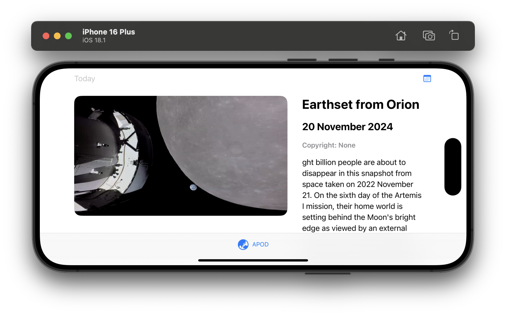

# NASA-APOD-SampleApp

## Description
A simple app which uses the NASA APOD API (https://github.com/nasa/apod-api).

## Screenshots
 

## Technical 
- SwiftUI base source code 
- MVVM design pattern with help of Coordinator 
- New Swift concurrency system

## Features
Basic Features: 
- On launch of the app, it loads the date, title, image, and the explanation for the current day's APOD. On some days, the image is replaced by an embedded video. 
- Users can load the NASA APOD for any day that they want. 

Bonus Features: 
- App works on both iPhone and iPad and different orientations. 
- Dark Mode support. 
- Dynamic Type Accessibility.
